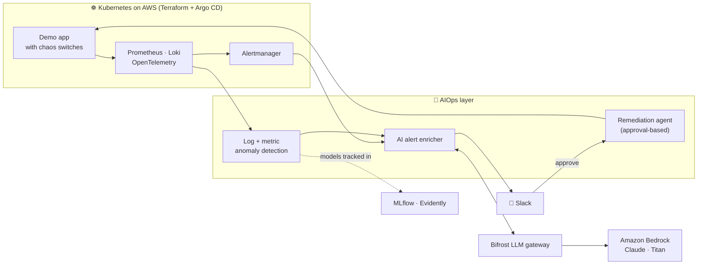

<!-- ═══════════════════════════ HEADER ═══════════════════════════ -->
<p align="center">
  
</p>

<p align="center">
  
</p>

<p align="center">
  <a href="mailto:amllanbhukta123@gmail.com"></a>
  <a href="https://github.com/amllan123?tab=repositories"></a>
  
</p>

---

## `$ whoami`

```console
$ kubectl get engineer amllan -o wide
NAME     ROLE              COMPANY   EXPERIENCE   STATUS    FOCUS
amllan   DevOps Engineer   Jar       2+ yrs       Running   K8s · AWS · GitOps · Observability · AIOps

$ kubectl describe engineer amllan | grep -A6 Spec
Spec:
  Builds:      Kubernetes platforms, GitOps pipelines, internal developer tooling
  Runs:        LLM gateway for 400+ developers (SSO, budgets, autoscaling)
  Believes:    toil should be automated, alerts should be actionable
  Learning:    SRE: SLOs, error budgets, incident response, Linux internals
  Building:    aiops-platform (from-scratch AIOps + MLOps on AWS)
  Location:    India 🇮🇳
```

## ⚡ Highlights

<table>
  <tr>
    <td width="50%" valign="top">

#### ☸️ Kubernetes platform
- Node autoscaling with **Karpenter** and workload scaling with **HPA**
- Per-team **staging namespaces** for isolated testing
- Safe rollouts with health probes and quick rollbacks

    </td>
    <td width="50%" valign="top">

#### 🔁 GitOps and developer platform
- **Argo CD** for declarative, Git-driven deployments
- **Backstage** self-service portal for developers
- Centralised secrets with **HashiCorp Vault**

    </td>
  </tr>
  <tr>
    <td width="50%" valign="top">

#### 🤖 AI platform
- Runs an internal **LLM gateway (Bifrost)** for **400+ developers**
- SSO login, **per-user budgets**, and autoscaling (**HPA 20 → 50 pods**)
- Cost and usage visibility per team

    </td>
    <td width="50%" valign="top">

#### 💬 AI support bot
- A **CRM assistant** answering support questions with an LLM
- **Guardrails** scope every answer to the signed-in user's own data
- Blocks system-level and cross-user questions

    </td>
  </tr>
</table>

## 🛠️ Now building: `aiops-platform`

> A production-style **AIOps + MLOps** platform, built from zero, fully in Git:
> **detect → explain → fix (with human approval)**.



| Layer | Stack |
|:--|:--|
| **Infra** | Terraform · Kubernetes on AWS · GitHub Actions · Argo CD |
| **Observability** | Prometheus · Alertmanager · Grafana · Loki · OpenTelemetry |
| **LLM gateway** | Self-hosted Bifrost → Amazon Bedrock (Claude, Titan embeddings) |
| **AIOps** | AI alert enricher · log anomaly detection (Drain3) · approval-based remediation agent · LLM evals in CI |
| **MLOps** | MLflow registry · Evidently drift detection · automated retraining · shadow/canary model deploys |

## 🧰 Tech stack

<table align="center">
  <tr>
    <td align="center" width="170"><b>☁️ Cloud</b></td>
    <td>
      
    </td>
  </tr>
  <tr>
    <td align="center"><b>📦 Containers &amp; orchestration</b></td>
    <td>
      
      &nbsp;
      &nbsp;
      
    </td>
  </tr>
  <tr>
    <td align="center"><b>🏗️ IaC, config &amp; secrets</b></td>
    <td>
      
      
    </td>
  </tr>
  <tr>
    <td align="center"><b>🔁 CI/CD &amp; platform</b></td>
    <td>
      
      &nbsp;
      &nbsp;
      
    </td>
  </tr>
  <tr>
    <td align="center"><b>📈 Observability</b></td>
    <td>
      
      &nbsp;
      
    </td>
  </tr>
  <tr>
    <td align="center"><b>🐧 OS, scripting &amp; tooling</b></td>
    <td>
      
    </td>
  </tr>
  <tr>
    <td align="center"><b>🗄️ Data</b></td>
    <td>
      
      
    </td>
  </tr>
  <tr>
    <td align="center"><b>🤖 AI &amp; MLOps</b></td>
    <td>
      
      &nbsp;
      &nbsp;
      
    </td>
  </tr>
  <tr>
    <td align="center"><b>🌐 Web (MERN)</b></td>
    <td>
      
    </td>
  </tr>
</table>

## 📌 Featured repositories

| Repository | What it is |
|:--|:--|
| 🚨 [**Scoutflo-SRE-Playbooks**](https://github.com/amllan123/Scoutflo-SRE-Playbooks) | Incident-response playbooks for AWS and Kubernetes: step-by-step guides for on-call engineers |
| 🧪 [**DevOps-Projects**](https://github.com/amllan123/DevOps-Projects) | Real-world DevOps projects, from beginner to advanced |
| 📈 [**Microservice-Monitroing**](https://github.com/amllan123/Microservice-Monitroing) | Monitoring stack for a microservices application |
| ⚙️ [**k8s-Ansible**](https://github.com/amllan123/k8s-Ansible) | Ansible automation to bootstrap a Kubernetes cluster |
| ☁️ [**EKS_Terraform**](https://github.com/amllan123/EKS_Terraform) | Amazon EKS provisioned with Terraform |

## 📊 GitHub stats

<p align="center">
  
  
</p>

<p align="center">
  
</p>

## 🐍 Contribution snake

<p align="center">
  <picture>
    <source media="(prefers-color-scheme: dark)" srcset="https://raw.githubusercontent.com/amllan123/amllan123/output/github-snake-dark.svg" />
    <source media="(prefers-color-scheme: light)" srcset="https://raw.githubusercontent.com/amllan123/amllan123/output/github-snake.svg" />
    
  </picture>
</p>

<!-- ═══════════════════════════ FOOTER ═══════════════════════════ -->
<p align="center">
  
</p>
